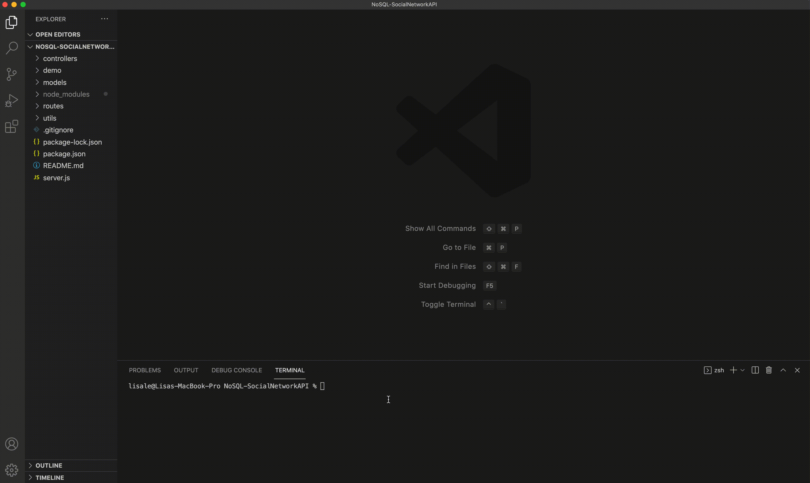

# Social Network API (NoSQL)
[](https://opensource.org/licenses/MIT)

## Description
An API for a social network web application where users can share their thoughts, react to friends’ thoughts, and create a friend list. This application uses Express, Node, MongoDB and Mongoose to allow users, thoughts, friend lists and thought reactions to be created, updated and deleted.

## Contents
- [Installation](#installation)
- [Demo](#demo)
- [Built With](#built-with)
- [Questions](#questions)
- [Credits](#credits)

## Installation
To install all the dependencies, use the command below

```
npm  install express mongoose
```

## Demo

### Setup and Start


### User Routes


### Add and Remove Friend


### Thought Routes


*Reaction demo video available in demo folder*

## Built With
- Express.js
- MongoDB
- Mongoose

## Questions
If you have any questions about the repo, please contact me via email at lisahuele@gmail.com. You can find more of my work on my GitHub, [lisahuele](https://github.com/lisahuele).

## Credits
Created by Lisa Le.
